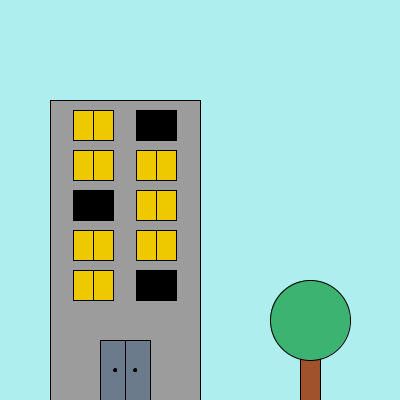
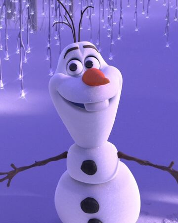
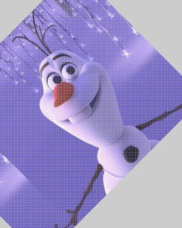
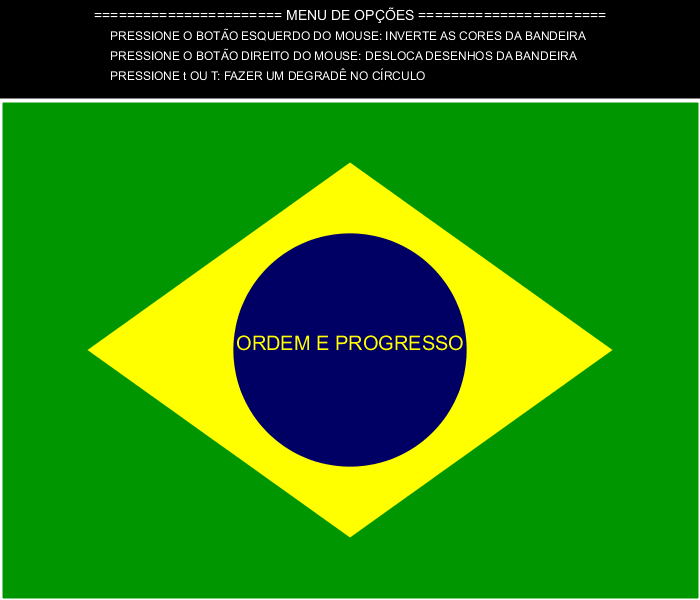
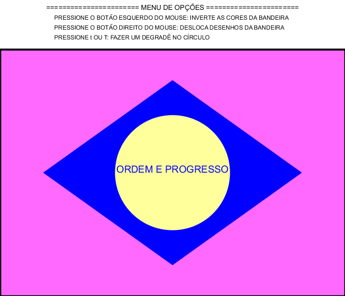
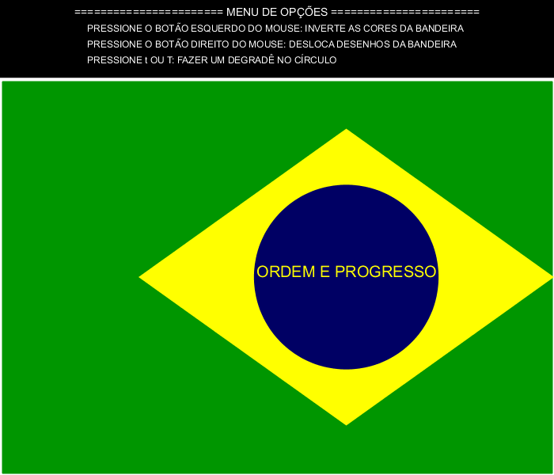
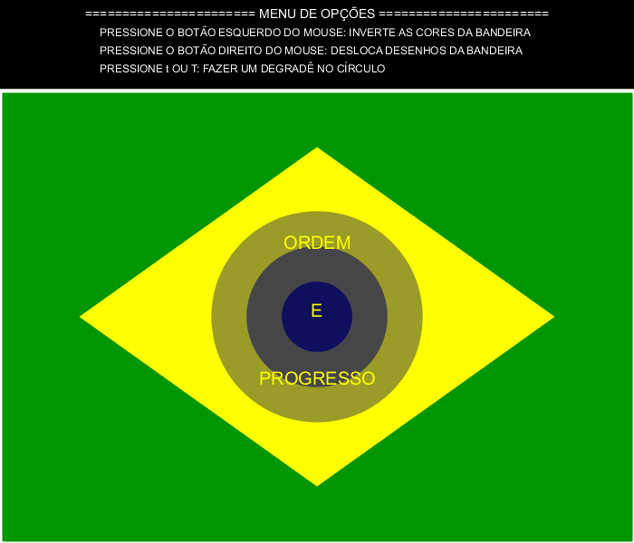
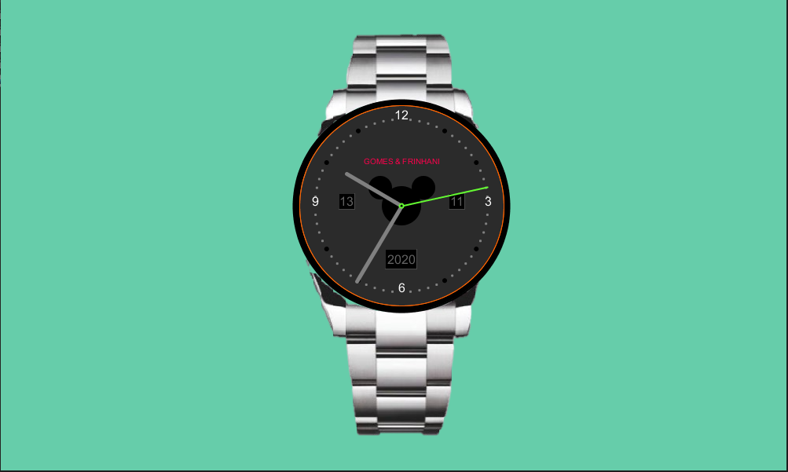
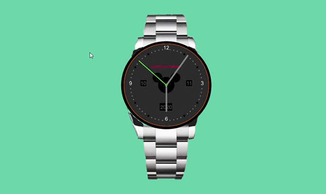
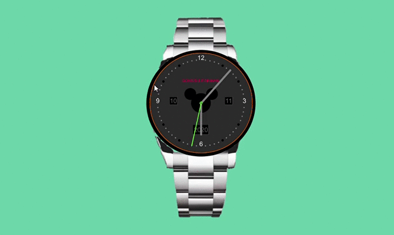

# Computação Gráfica 👾📚

## Objetivo 📝
Intruduzir os conceitos básicos de representação e computação gráfica do ponto de vista de desenvolvimento de sistemas em duas e três dimensões, utilizando ferramentas de programação.

## Algoritmos 📂

- [Desenho de formas geométricas](https://github.com/thaina-gomes/computer-graphics/blob/master/algorithms/desenha_formas_geometricas.pde) 

Um algoritmo simples, cuja finalidade é de ter um contato inicial com o programa Processing e com a criação de desenhos com formas geométricas.

	

---

- [Inverção de cores dos pixels](https://github.com/thaina-gomes/computer-graphics/blob/master/algorithms/inverte-cores-pixels.pde) 

Algoritmo que dada uma certa imagem, percorre cada pixel e inverte as cores de cada um.

	
	

---

- [Espelha imagem](https://github.com/thaina-gomes/computer-graphics/blob/master/algorithms/inverte-imagem.pde) 

Algoritmo que dada uma certa imagem, espelha ela na horizontal e na vertical.

	
	
	

---

- [Rotaciona imagem](https://github.com/thaina-gomes/computer-graphics/blob/master/algorithms/rotaciona-imagem.pde)

Algoritmo que dada uma certa imagem, percorre os pixels, rotacionando-os a um ângulo de 45°.

	
	

---

- [Interação com mouse e teclado](https://github.com/thaina-gomes/computer-graphics/blob/master/algorithms/avaliacao_1.pde) 

Algoritmo que desenha a bandeira do Brasil, resultando na seguinte imagem.

	

É possível fazer alterações na imagem com as seguintes interações:

-> Clicando com o botão esquerdo do mouse, as cores dos pixels são invertidas

	

-> Clicando com o botão direito do mouse, a bandeira é deslocada para a direita

	

-> Digitando a tecla "t" ou "T", o círculo azul forma um degradê e a frase "ORDEM E PROGRESSO" é centralizada.

	

---

- [Projeto Relógio 2D](https://github.com/thaina-gomes/computer-graphics/blob/master/algorithms/Projeto_Relogio_2D) 

Algoritmo que desenha display do relógio em 2D analógico, que informa a hora atual do sistema.

	

É possível fazer interações com o relógio, da seguinte forma:

-> Clicando com o botão esquerdo do mouse, é possível movimentar o relógio ao arrastar o mouse

	

-> Clicando com o botão direito do mouse, o display vira um círculo que se movimennta limitado pelas margens.

	

-> Digitando a tecla "c" ou "C", o contorno do relógio é alterado.

	

-> Digitando a tecla "d" ou "D", no display é gerado um degradê de azul.

	

-> Digitando a tecla "i" ou "I", os pixels da imagem são invertidos.

	

---

- [Iluminação ambiente](https://github.com/thaina-gomes/computer-graphics/blob/master/algorithms/iluminacao.pde) 

Algoritmo que desenha uma imagem, e utilizando os recursos de iluminação do processing, ao arrastar o mouse, ela vai se adaptando com a posição dele.

	

